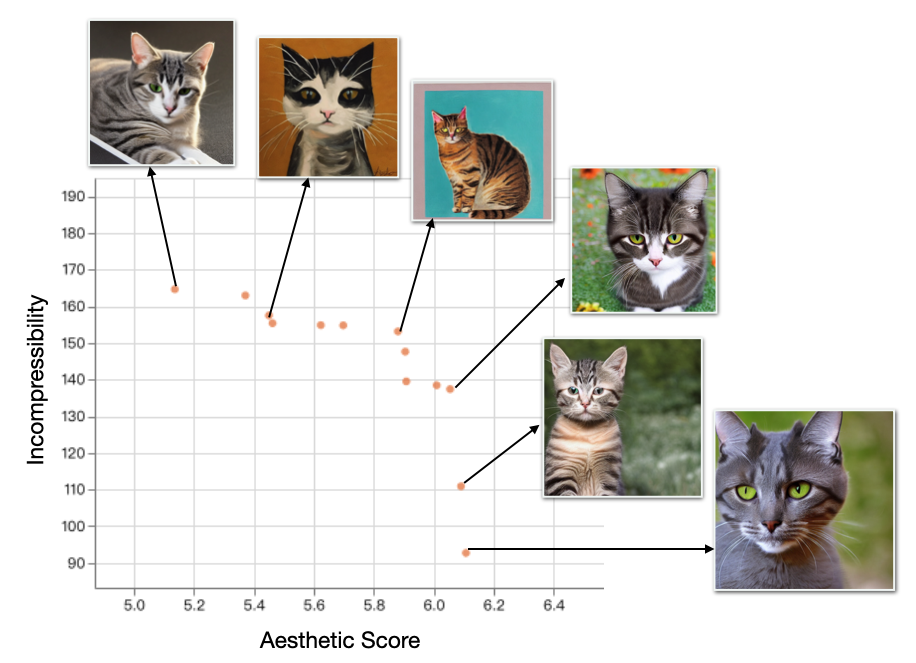

# Training Diffusion Model with Multi-Objective Reinforcement Learning
View our [Poster](ddpo/assets/img/DLP.png) for comprehensive information of our project.

Our repository's code is referenced from [DDPO](https://github.com/kvablack/ddpo-pytorch) and [MORL_Baseline](https://github.com/LucasAlegre/morl-baselines).

## Motivation
Human preference is complex. Usually, we have multi-objective rewards. For example 30% compressibility and 70% aesthetic quality. Furthermore, considering multi-objective rewards can somehow solve the over optimization problem ([Kevin Black 2024](https://arxiv.org/pdf/2305.13301)), since it gives constrain to each reward in the preference.

<div align="center" padding="20px">
  
</div>


## Installation
Requires Python 3.10 or newer. Install the package in your virtual env:
```shell
pip install -r requires.txt
```

## Usage
Set up the configuration of accelerate. Choose your device and set up distributed training.
```shell
accelerate config
```
Training:
```shell
python -m accelerate.commands.launch mo_train.py
```

## Method
Our method combines [DDPO](https://arxiv.org/pdf/2305.13301) and [PGMORL](https://people.csail.mit.edu/jiex/papers/PGMORL/paper.pdf). The algorithm consists of warm-up stage and evolutionary stage. The goal of PGMORL is to approximate the Pareto front, which consists of policies that represent optimal trade-offs among the objectives.

<div align="center" padding="20px">
  
</div>

1. Warm-up stage
    - Generate task set $\mathcal{T}=\{(\pi_i,\omega_i)_{i=1}^n\}$ by initial policies and evenly distributed weight vectors. Here $\pi_i$ is LORA layers.
    - Every agent updates on its own: where $r(x_0,c)$ is multi-dimension rewards.
    - Every agent does sampling and updating independently. We only update the LORA layer and share the pretrained UNet. Storing $(\text{F}(\pi_i), \text{F}(\pi_i^{'}), \omega_i)$ in history $\mathcal{R}$ for further prediction.
```math
\nabla_{\theta} \mathcal{J}_{\text{DDRL}}(\omega_i) = \mathbb{E} \left[ \sum_{t=0}^{T} \frac{p_{\theta}(\mathbf{x}_{t-1} \mid \mathbf{x}_{t}, \mathbf{c})}{p_{\theta_{\text{old}}}(\mathbf{x}_{t-1} \mid \mathbf{x}_{t}, \mathbf{c})} \nabla_{\theta} \log p_{\theta}(\mathbf{x}_{t-1} \mid \mathbf{x}_{t}, \mathbf{c}) \, \omega_i^{\top} r(\mathbf{x}_{0}, \mathbf{c}) \right]
```
2. Evolutionary stage 
    - Fit improvement predition models for each policy from history data $\mathcal{R}$.
    - Sample $K$ candidate weight in the objective space. Given $K \times N$ candidate points, we want to select n of them that can maximize hyper volume and minimize sparsity.
    - We can iteratively update our population and keep iteract with environment with new task set $\mathcal{T}=\{(\pi_i,\omega_i)_{i=1}^n\}$.

<div align="center" padding="20px">
  
</div>

## Experiments
Here we experiment two reward combinations: **Aesthetic Score + Compressibility** & **Aesthetic Score + Incompressibility**
### Aesthetic Score + Compressibility
#### Pareto Front:

<div align="center" padding="20px">
  
</div>

#### HyperVolume:

<div align="center" padding="20px">
  
</div>


### Aesthetic Score + Incompressibility
#### Pareto Front:

<div align="center" padding="20px">
  
</div>

#### HyperVolume:

<div align="center" padding="20px">
  
</div>


## Limitations and Future Works
- **Computation Efficiency**: PGMORL is an evolutionary algorithm which needs many populations to search the objective space. Since diffusion model is computation costly, we have hard time to fit few agents into GPU memory. Furthermore, due to the limited GPU memory, we can not train agents parallely. In single epoch, we need to train $n$ agents, which increase training time.
- **Sample Efficiency**: DDPO requires large number of samples to reach high reward. Is it the best way to fine tune the powerful pretrained DDPM?
